# Current UX Flow Problems Analysis

This document analyzes the current implementation bugs and UX issues in the shader demo preset system.

## 🚨 Critical Problems Identified

### 1. **Multiple Untitled Presets Created**
**Expected**: Single "Untitled" preset per session that gets overwritten  
**Current**: Creates multiple "Untitled" presets, requires cleanup

```dart
// Problem: In PresetService.saveUntitledPreset()
final existingUntitledPreset = allPresets.where((p) => p.name == presetName).toList();
// ❌ This finds existing but still can create duplicates due to race conditions
```

**Issues**:
- Race conditions during rapid slider changes
- Cleanup required on app startup: `cleanupDuplicateUntitledPresetsWithReturn()`
- Memory waste from duplicate presets
- Confusing UX when multiple "Untitled" appear in preset list

### 2. **Excessive Thumbnail Generation**
**Expected**: Only generate thumbnails when user opens preset menu  
**Current**: Generates thumbnails during every slider change

```dart
// Problem: Thumbnails generated constantly in saveChangesImmediately()
PresetService.saveChangesImmediately(
  previewKey: _state.showAspectSliders ? null : _previewKey, // ❌ Still captures
```

**Issues**:
- Memory pressure from constant thumbnail generation
- Rate limiting required: `_minThumbnailIntervalMs = 5000`
- Performance degradation during editing
- Unnecessary GPU/CPU usage

### 3. **No Duplicate Filtering in Slideshow**
**Expected**: Hide untitled preset if identical to any saved preset  
**Current**: Shows all presets regardless of content similarity

```dart
// Problem: In SlideshowController.getVisiblePresets()
List<ShaderPreset> getVisiblePresets(List<ShaderPreset> allPresets) {
  return allPresets.where((preset) => !preset.isHiddenFromSlideshow).toList();
  // ❌ Only filters manually hidden presets, not content duplicates
}
```

**Issues**:
- Slideshow shows duplicate visual content
- Poor user experience with redundant slides
- No smart content comparison

### 4. **Complex State Management**
**Expected**: Clear ownership - either untitled or named preset  
**Current**: Multiple state tracking variables create confusion

```dart
// Problem: Too many state variables in ShaderDemoState
String? currentUntitledPresetId;
int currentPresetIndex = -1;
ShaderSettings? unsavedSettings;
String? unsavedImage;
ImageCategory? unsavedCategory;
// ❌ Overly complex state that can get out of sync
```

**Issues**:
- State synchronization bugs
- Memory leaks from unsaved state tracking
- Complex cleanup logic required

### 5. **Delayed/Timer-Based Operations**
**Expected**: Immediate, event-driven updates  
**Current**: Some operations use timers and delays

```dart
// Problem: Rate limiting creates delays
DateTime _lastThumbnailCaptureTime = DateTime.now().subtract(Duration(minutes: 1));
static const int _minThumbnailIntervalMs = 5000;
// ❌ Creates artificial delays in user feedback
```

**Issues**:
- User changes don't feel immediate
- Inconsistent response times
- Poor perceived performance

## 🔄 Current Flow vs Expected Flow

```mermaid
graph TD
    subgraph "❌ Current Broken Flow"
        A1["App Launch"] --> B1["Multiple Untitled Presets<br/>May Exist"]
        B1 --> C1["User Adjusts Controls"]
        C1 --> D1["Create New Untitled<br/>OR Update Existing<br/>OR Rate Limited"]
        D1 --> E1["Generate Thumbnail<br/>Every 5 Seconds"]
        E1 --> F1["Slideshow Shows<br/>All Presets Including<br/>Duplicates"]
    end
    
    subgraph "✅ Expected Clean Flow"  
        A2["App Launch"] --> B2["Single Untitled Preset"]
        B2 --> C2["User Adjusts Controls"]
        C2 --> D2["Update Untitled<br/>Immediately"]
        D2 --> E2["No Thumbnail<br/>Generation"]
        E2 --> F2["Slideshow Filters<br/>Unique Content Only"]
    end
    
    style A1 fill:#ffcdd2,stroke:#d32f2f,stroke-width:2px,color:#000
    style D1 fill:#ffcdd2,stroke:#d32f2f,stroke-width:2px,color:#000
    style E1 fill:#ffcdd2,stroke:#d32f2f,stroke-width:2px,color:#000
    style F1 fill:#ffcdd2,stroke:#d32f2f,stroke-width:2px,color:#000
    
    style A2 fill:#c8e6c9,stroke:#388e3c,stroke-width:2px,color:#000
    style D2 fill:#c8e6c9,stroke:#388e3c,stroke-width:2px,color:#000
    style E2 fill:#c8e6c9,stroke:#388e3c,stroke-width:2px,color:#000
    style F2 fill:#c8e6c9,stroke:#388e3c,stroke-width:2px,color:#000
```



## 🐛 Specific Code Issues

### Issue 1: Slideshow Entry Logic
```dart
// ❌ Current problematic logic in _buildSlideshowView()
if (_state.currentPresetIndex >= 0 && !_justEnteredSlideshowMode) {
  _applyPreset(_state.availablePresets[_state.currentPresetIndex], showControls: false);
} else if (_justEnteredSlideshowMode) {
  _justEnteredSlideshowMode = false; // ❌ Flag management is fragile
}
```

### Issue 2: Thumbnail Rate Limiting
```dart
// ❌ Artificial delays in saveChangesImmediately
if (now.difference(_lastThumbnailCaptureTime).inMilliseconds < _minThumbnailIntervalMs) {
  print("Skipping thumbnail capture due to rate limiting");
} else {
  _isCapturingThumbnail = true; // ❌ Should never capture during editing
}
```

### Issue 3: Complex Preset Cleanup
```dart
// ❌ Requires cleanup on startup
final result = await PresetService.cleanupDuplicateUntitledPresetsWithReturn();
// This shouldn't be necessary with proper architecture
```

## 💡 Root Cause Analysis

### **Architecture Problems**:
1. **Reactive vs Proactive**: System reacts to problems instead of preventing them
2. **Mixed Responsibilities**: Preset management mixed with UI state
3. **Resource Management**: No clear ownership of when thumbnails should exist
4. **State Synchronization**: Multiple sources of truth create inconsistency

### **UX Problems**:
1. **Performance**: Constant thumbnail generation impacts responsiveness
2. **Memory**: Multiple untitled presets and thumbnails consume memory
3. **Consistency**: User sees duplicate content in slideshow
4. **Feedback**: Delays make the app feel unresponsive

## 🎯 Solution Requirements

To fix these issues, the implementation needs:

1. **Single Untitled Management**: One untitled preset per session, overwritten on changes
2. **On-Demand Thumbnails**: Generate only when preset menu is opened
3. **Smart Slideshow Filtering**: Compare preset content, not just names
4. **Immediate Updates**: Event-driven architecture without artificial delays
5. **Simplified State**: Clear ownership model for preset state

## 📊 Impact Assessment

| Problem | User Impact | Performance Impact | Code Complexity |
|---------|-------------|-------------------|-----------------|
| Multiple Untitled | 🔴 High | 🟡 Medium | 🔴 High |
| Excessive Thumbnails | 🟡 Medium | 🔴 High | 🟡 Medium |
| No Duplicate Filtering | 🔴 High | 🟢 Low | 🟢 Low |
| Complex State | 🟡 Medium | 🟡 Medium | 🔴 High |
| Timer-Based Operations | 🟡 Medium | 🟡 Medium | 🟡 Medium |

**Priority**: Fix Multiple Untitled → Duplicate Filtering → Thumbnail Generation → State Simplification → Remove Timers 