# Shader Demo Preset Data Flow

This document shows the correct data flow for shader preset management without bugs.

## Expected Behavior

- **Brand new installed app**: loads with untitled preset and control panel visible
- **Control changes**: immediately update untitled preset and view (no delays)
- **Slideshow mode**: hide controls, show only unique presets
- **Untitled filtering**: only show untitled in slideshow if different from all saved presets
- **Thumbnail generation**: only when user opens preset menu (on-demand)

```mermaid
graph TD
    A["App Launch"] --> B["Initialize Untitled Preset<br/>• Default settings<br/>• No thumbnail<br/>• Show control panel"]
    
    B --> C["User Adjusts Controls<br/>• Color/Blur/Effects/etc."]
    C --> D["Update Untitled Preset<br/>Immediately<br/>• Overwrite existing untitled<br/>• No thumbnail generation<br/>• Live preview update"]
    
    D --> E{"User Action"}
    E -->|"Continue Adjusting"| C
    E -->|"Tap Screen"| F["Enter Slideshow Mode"]
    E -->|"Save Preset"| G["Save Named Preset"]
    
    F --> H["Slideshow Logic:<br/>Filter Unique Presets"]
    H --> I{"Untitled Same as<br/>Any Saved Preset?"}
    I -->|"Yes"| J["Show Only Saved Presets<br/>• Hide duplicate untitled<br/>• Display unique presets"]
    I -->|"No"| K["Show All Including Untitled<br/>• Untitled is unique<br/>• Display all presets"]
    
    J --> L["PageView Slideshow<br/>• No control panel<br/>• Swipe between presets"]
    K --> L
    
    L --> M{"User Taps Screen"}
    M -->|"Return to Controls"| N["Show Control Panel<br/>• Resume with current preset<br/>• Enable editing"]
    M -->|"Continue Slideshow"| L
    
    G --> O["Create Named Preset<br/>• Copy current settings<br/>• Store with name<br/>• No thumbnail yet"]
    O --> P["Update Preset List<br/>• Add to available presets<br/>• Set as current preset"]
    P --> Q{"Continue Editing?"}
    Q -->|"Yes"| C
    Q -->|"Enter Slideshow"| F
    
    N --> R{"Make Changes?"}
    R -->|"Yes"| S["Modify Current Preset<br/>• If untitled: update untitled<br/>• If named: create new untitled"]
    R -->|"No"| T["Stay on Current Preset"]
    S --> C
    T --> E
    
    U["User Opens Preset Menu"] --> V["Generate Thumbnails<br/>On-Demand Only<br/>• Render current settings<br/>• Cache temporarily<br/>• Display in grid"]
    V --> W["User Selects Preset"] 
    W --> X["Load Preset Settings<br/>• Apply to current view<br/>• Update control panel<br/>• Set as current preset"]
    X --> E
    
    style A fill:#e3f2fd,stroke:#1976d2,stroke-width:2px,color:#000
    style B fill:#f3e5f5,stroke:#7b1fa2,stroke-width:2px,color:#000
    style D fill:#e8f5e8,stroke:#388e3c,stroke-width:2px,color:#000
    style H fill:#fff3e0,stroke:#f57c00,stroke-width:2px,color:#000
    style V fill:#ffebee,stroke:#d32f2f,stroke-width:2px,color:#000
    
    classDef userAction fill:#bbdefb,stroke:#1976d2,stroke-width:2px,color:#000
    classDef systemLogic fill:#c8e6c9,stroke:#388e3c,stroke-width:2px,color:#000
    classDef presetOp fill:#ffe0b2,stroke:#ff9800,stroke-width:2px,color:#000
    classDef slideshow fill:#f8bbd9,stroke:#e91e63,stroke-width:2px,color:#000
    
    class C,E,M,Q,R,U,W userAction
    class I,H,P,S,X systemLogic
    class G,O,V presetOp
    class F,J,K,L slideshow
```

## Key Architecture Principles

### 🎯 **Untitled Preset Management**
- **Single untitled preset** per session that gets overwritten with each change
- **Real-time updates** - no delays or timers, immediate preset modification
- **Smart slideshow filtering** - untitled only shows if unique from saved presets

### 🎬 **Slideshow Logic** 
- **Deduplication**: If untitled preset equals any saved preset, hide untitled from slideshow
- **Unique content only**: Only display visually different presets
- **Seamless transitions**: No control panel in slideshow mode

### 🖼️ **Thumbnail Generation**
- **On-demand only**: Generate thumbnails when user opens preset menu
- **No automatic generation**: Never create thumbnails during normal editing
- **Memory efficient**: Generate, display, then can discard

### 💾 **State Management**
- **Immediate persistence**: All control changes instantly update untitled preset
- **Clear ownership**: Current preset is either untitled (for edits) or named (for saved)
- **No unsaved state**: Everything is always saved to either untitled or named preset

### 👤 **User Experience Flow**
1. **Start**: App loads with untitled preset + controls
2. **Edit**: Controls immediately modify untitled preset
3. **Slideshow**: Hide controls, show only unique presets  
4. **Save**: Create named preset, continue editing
5. **Menu**: Generate thumbnails on-demand for selection

## Bug Fixes Implemented

This flow eliminates several critical bugs:
- ❌ **Multiple untitled presets**: Now maintains single untitled per session
- ❌ **Unnecessary thumbnail generation**: Only generates when viewing preset menu
- ❌ **Duplicate slideshow entries**: Filters out untitled if identical to saved presets
- ❌ **Delayed updates**: All changes are immediate and event-driven
- ❌ **Memory leaks**: Thumbnails generated on-demand and can be discarded 